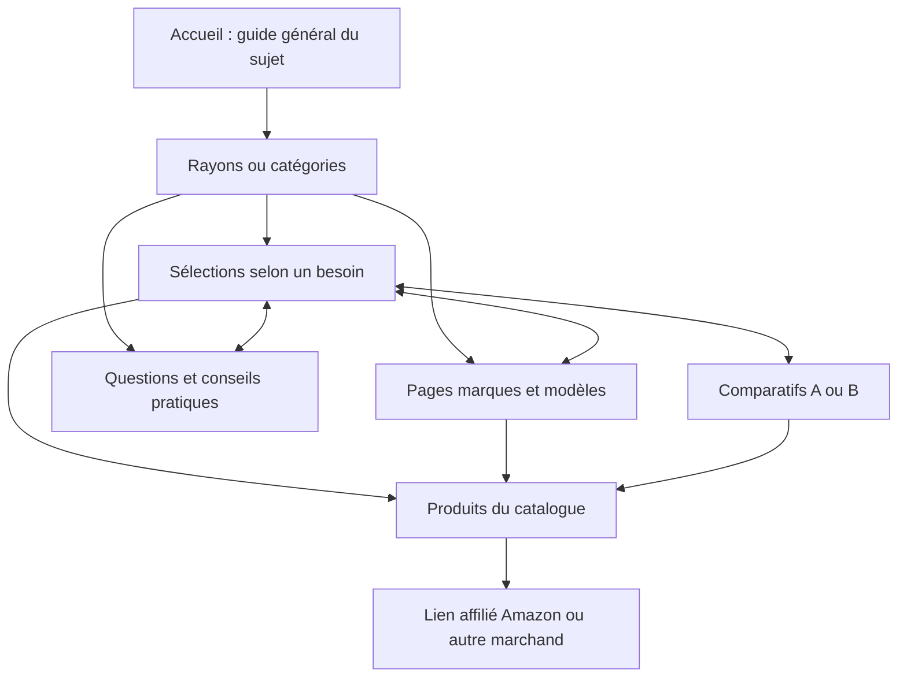

# Architecture de référence des sites de Thomas

Pour les sites affiliés, comparateurs et éditoriaux, prendre ce graphe comme architecture initiale explicite. Respecter les routes existantes validées et noter les adaptations. Pour un site marchand, le marchand externe devient un achat réel ; pour une vitrine, les produits deviennent services/preuves et l'action devient un contact. Ne pas inventer de marques, de catalogue marchand ou d'affiliation pour remplir le graphe.

Le graphe représente des relations de contenu et de navigation ; le catalogue est aussi une source de données. Il n'impose pas une page publique par produit ni un clic supplémentaire avant le marchand. Une fiche produit affichée dans un guide peut porter directement son lien marchand.

## Réalisation

1. Carte des intentions : une question distincte, une réponse utile et des données suffisantes avant chaque URL.
2. Catalogue partagé : IDs exacts, références, attributs/unités, source, date, droits médias, offres et disponibilité lorsqu'utilisables. Les pages référencent les mêmes entités.
3. Catégories : introduire le besoin, organiser les options, pointer vers les guides spécialisés.
4. Sélections : contraintes ou usages explicites ; critères, limites et alternatives.
5. Marques/modèles : seulement quand la recherche et les données permettent une analyse distincte.
6. Comparatifs : arbitrage réel entre options ; ne pas dupliquer une catégorie sous « meilleur » sans valeur supplémentaire.
7. Questions : réponse autonome, puis sélection pertinente si utile ; ne pas forcer un produit pour chaque question.
8. Maillage : parent, alternatives, prochain besoin et retour contextuel. Liens HTML descriptifs, aucun bloc massif de liens artificiels.
9. Destination commerciale : référence exacte, divulgation affiliée et lien testé ; distinguer clic, vente et commission.

Pour chaque famille, enregistrer routes prévues, état, sources et preuve dans le MASTER. Une famille sans utilité ou données est explicitement non applicable ou bloquée ; elle ne disparaît pas silencieusement. La structure et son déploiement ne prouvent ni autorité, ni trafic, ni revenu.
